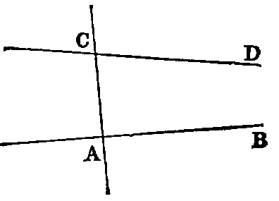

# Axioms

i. Things which are equal to the same, or to equals, are equal to each other.

Thus, if there be three things, and if the first, and the second, be each equal to the third, we infer by this axiom that the first is equal to the second. This axiom relates to all kinds of magnitude. The same is true of Axioms ii., iii., iv., v., vi., vii., ix.; but viii., x., xi., xii., are strictly geometrical.

ii. If equals be added to equals the sums will be equal.

iii. If equals be taken from equals the remainders will be equal.

iv. If equals be added to unequals the sums will be unequal.

v. If equals be taken from unequals the remainders will be unequal.

vi. The doubles of equal magnitudes are equal.

vii. The halves of equal magnitudes are equal.

viii. Magnitudes that can be made to coincide are equal.

The placing of one geometrical magnitude on another, such as a line on a line, a triangle on a triangle, or a circle on a circle, &c., is called superposition. The superposition employed in Geometry is only mental, that is, we conceive one magnitude placed on the other; and then, if we can prove that they coincide, we infer, by the present axiom, that they are equal. Superposition involves the following principle, of which, without explicitly stating it, Euclid makes frequent use:—“Any figure may be transferred from one position to another without change of form or size.”

ix. The whole is greater than its part.

This axiom is included in the following, which is a fuller statement:—

ix′. The whole is equal to the sum of all its parts.

x. Two right lines cannot enclose a space.

This is equivalent to the statement, “If two right lines have two points common to both, they coincide in direction,” that is, they form but one line, and this holds true even when one of the points is at infinity.

xi. All right angles are equal to one another.

This can be proved as follows:—Let there be two right lines AB, CD, and two perpendiculars to them, namely, EF, GH, then if AB, CD be made to coincide by superposition, so that the point E will coincide with G; then since a right angle is equal to its supplement, the line EF must coincide with GH. Hence the angle AEF is equal to CGH.

xii. If two right lines (AB, CD) meet a third line (AC), so as to make the sum of the two interior angles (BAC, ACD) on the same side less than two right angles, these lines being produced shall meet at some finite distance.

This axiom is the converse of Prop. xvii., Book I.
