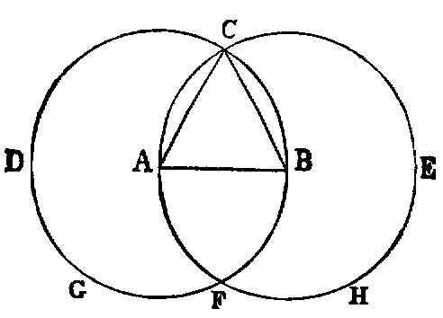

# Proposition 1: Equilateral Triangle From Finite Right Line

## Problem
* On a given finite right line (AB) to construct an equilateral triangle.

## Solution
* With A as centre, and AB as radius, describe the circle BCD (Post. iii.).
* With B as centre, and BA as radius, describe the circle ACE, cutting the former circle in C.
* Join CA, CB (Post. i.).
* Then ABC is the equilateral triangle required.

## Demonstration
* Because A is the centre of the circle BCD, AC is equal to AB (Def. xxxii.).
* Again, because B is the centre of the circle ACE, BC is equal to BA.
* Hence we have proved: `AC = AB`, and `BC = AB`.
* But things which are equal to the same are equal to one another (Axiom i.);
* therefore AC is equal to BC;
* therefore the three lines AB, BC, CA are equal to one another.
* Hence the triangle ABC is equilateral (Def. xxi.);
* and it is described on the given line AB, which was required to be done.

## Questions for Examination

1. What is the datum in this proposition?
2. What is the quaesitum?
3. What is a finite right line?
4. What is the opposite of finite?
5. In what part of the construction is the third postulate quoted? and for what purpose? Where is the first postulate quoted?
6. Where is the first axiom quoted?
7. What use is made of the definition of a circle? What is a circle?
8. What is an equilateral triangle?

## Exercises

The following exercises are to be solved when the pupil has mastered the First Book:

1. If the lines AF, BF be joined, the figure ACBF is a lozenge.
2. If AB be produced to D and E, the triangles CDF and CEF are equilateral.
3. If CA, CB be produced to meet the circles again in G and H, the points G, F, H are collinear, and the triangle GCH is equilateral.
4. If CF be joined, CF2 = 3AB2.
5. Describe a circle in the space ACB, bounded by the line AB and the two circles.
