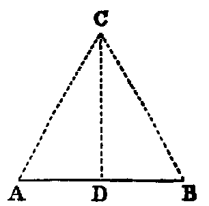

# Proposition 10: Bisect a Given Line

## Problem
* To bisect a given finite right line (AB).

## Solution
* Upon AB describe an equilateral triangle ACB [i.].
* Bisect the angle ACB by the line CD [ix.], meeting AB in D,
* then AB is bisected in D.

## Demonstration
* The two triangles ACD, BCD, have the side AC equal to BC, being the sides of an equilateral triangle, and CD common.
* Therefore the two sides AC, CD in one are equal to the two sides BC, CD in the other;
* and the angle ACD is equal to the angle BCD (const.).
* Therefore the base AD is equal to the base DB [iv.].
* Hence AB is bisected in D.

## Exercises

1. Show how to bisect a finite right line by describing two circles.
2. Every point equally distant from the points A, B is in the line CD.
