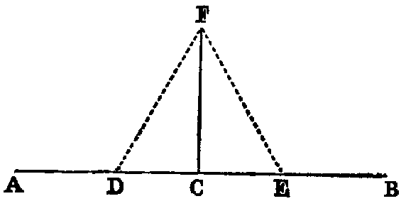

# Proposition 11: Draw Line Perpendicular to Given Line at Given Point

## Problem
* From a given point (C) in a given right line (AB) to draw a right line perpendicular to the given line.

## Solution
* In AC take any point D, and make CE equal to CD [iii.].
* Upon DE describe an equilateral triangle DFE [i.].
* Join CF.
* Then CF shall be at right angles to AB.

## Demonstration
* The two triangles DCF, ECF have CD equal to CE (const.) and CF common;
* therefore the two sides CD, CF in one are respectively equal to the two sides CE, CF in the other,
* and the base DF is equal to the base EF, being the sides of an equilateral triangle (Def. xxi.);
* therefore [viii.] the angle DCE is equal to the angle ECF, and they are adjacent angles.
* Therefore (Def. xiii.) each of them is a right angle, and CF is perpendicular to AB at the point C.

## Exercises

1. The diagonals of a lozenge bisect each other perpendicularly.
2. Prove Prop. xi. without using Prop. viii.
3. Erect a line at right angles to a given line at one of its extremities without producing the line.
4. Find a point in a given line that shall be equally distant from two given points.
5. Find a point in a given line such that, if it be joined to two given points on opposite sides of the line, the angle formed by the joining lines shall be bisected by the given line.
6. Find a point that shall be equidistant from three given points.
