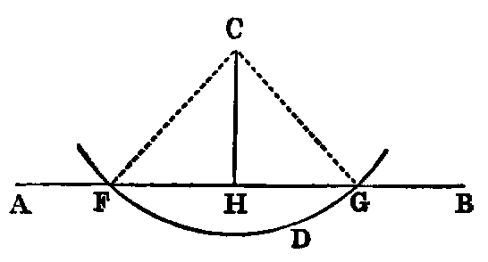

# Proposition 12: Draw Perpendicular to Given Indefinite Line at Given Point Off It

## Problem
* To draw a perpendicular to a given indefinite right line (AB) from a given point (C) without it.

## Solution
* Take any point D on the other side of AB, and describe (Post. iii.) a circle, with C as centre, and CD as radius, meeting AB in the points F and G.
* Bisect FG in H [x.].
* Join CH (Post. i.).
* CH shall be at right angles to AB.

## Demonstration
* Join CF, CG.
* Then the two triangles FHC, GHC have FH equal to GH (const.), and HC common;
* and the base CF equal to the base CG, being radii of the circle FDG (Def. xxxii.).
* Therefore the angle CHF is equal to the angle CHG [viii.], and, being adjacent angles, they are right angles (Def. xiii.).
* Therefore CH is perpendicular to AB.

## Exercises

1. Prove that the circle cannot meet AB in more than two points.
2. If one angle of a triangle be equal to the sum of the other two, the triangle can be divided into the sum of two isosceles triangles, and the base is equal to twice the line from its middle point to the opposite angle.
