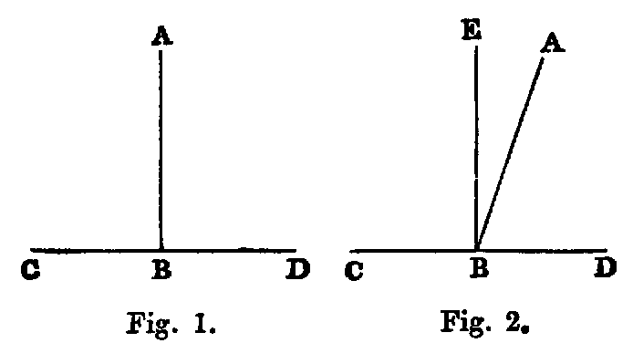

# Proposition 13: Adjacent Angles Sum to Two Right Angles

## Theorem
* The adjacent angles (ABC, ABD) which one right line (AB) standing on another (CD) makes with it are either both right angles, or their sum is equal to two right angles.

## Demonstration
* If AB is perpendicular to CD, as in fig. 1, the angles ABC, ABD are right angles.
* If not, draw BE perpendicular to CD [xi.].
* Now the angle CBA is equal to the sum of the two angles CBE, EBA (Def. xi.).
* Hence, adding the angle ABD, the sum of the angles CBA, ABD is equal to the sum of the three angles CBE, EBA, ABD.
* In like manner, the sum of the angles CBE, EBD is equal to the sum of the three angles CBE, EBA, ABD.
* And things which are equal to the same are equal to one another.
* Therefore the sum of the angles CBA, ABD is equal to the sum of the angles CBE, EBD;
* but CBE, EBD are right angles;
* therefore the sum of the angles CBA, ABD is two right angles.

* Or thus:
  * Denote the angle EBA by θ;
  * then evidently the angle CBA = right angle + θ;
 	* the angle ABD = right angle − θ;
 	* therefore CBA + ABD = two right angles.

## Corollaries
1. The sum of two supplemental angles is two right angles.
2. Two right lines cannot have a common segment.
3. The bisector of any angle bisects the corresponding re-entrant angle.
4. The bisectors of two supplemental angles are at right angles to each other.
5. The angle EBA is half the difference of the angles CBA, ABD.

