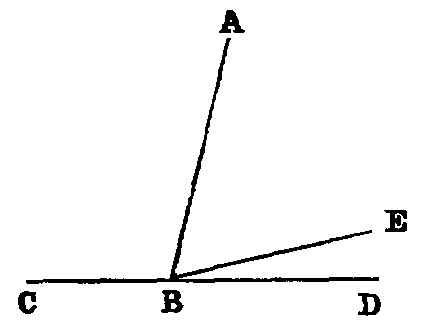

# Proposition 14: Adjacent Angles Summing to Two Right Angles form a Right Line

## Theorem
* If at a point (B) in a right line (BA) two other right lines (CB, BD) on opposite sides make the adjacent angles (CBA, ABD) together equal to two right angles, these two right lines form one continuous line.

## Demonstration
* If BD be not the continuation of CB, let BE be its continuation.
* Now, since CBE is a right line, and BA stands on it, the sum of the angles CBA, ABE is two right angles (xiii.);
* and the sum of the angles CBA, ABD is two right angles (hyp.);
* therefore the sum of the angles CBA, ABE is equal to the sum of the angles CBA, ABD.
* Reject the angle CBA, which is common, and we have the angle ABE equal to the angle ABD — that is, a part equal to the whole — which is absurd.
* Hence BD must be in the same right line with CB.
