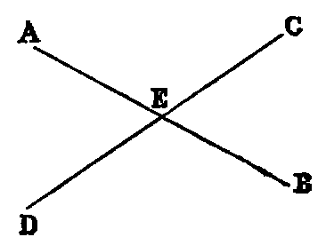

# Proposition 15: Opposite Angles of Intersecting Lines are Equal

## Theorem
* If two right lines (AB, CD) intersect one another, the opposite angles are equal (CEA = DEB, and BEC = AED).

## Demonstration
* Because the line AE stands on CD, the sum of the angles CEA, AED is two right angles [xiii.];
* and because the line CE stands on AB, the sum of the angles BEC, CEA is two right angles;
* therefore the sum of the angles CEA, AED is equal to the sum of the angles BEC, CEA.
* Reject the angle CEA, which is common, and we have the angle AED equal to BEC.
* In like manner, the angle CEA is equal to DEB.

The foregoing proof may be briefly given, by saying that opposite angles are equal because they have a common supplement.

## Questions for Examination
on Props. XIII., XIV., XV.

1. What problem is required in Euclid’s proof of Prop. xiii.?
2. What theorem? Ans. No theorem, only the axioms.
3. If two lines intersect, how many pairs of supplemental angles do they make?
4. What relation does Prop. xiv. bear to Prop. xiii.?
5. What three lines in Prop. xiv. are concurrent?
6. What caution is required in the enunciation of Prop. xiv.?
7. State the converse of Prop. xv. Prove it.
8. What is the subject of Props. xiii., xiv., xv.? Ans. Angles at a point.
