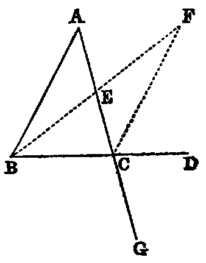

# Proposition 16: Exterior Angle Greater Than Interior Angles

## Theorem
* If any side (BC) of a triangle (ABC) be produced, the exterior angle (ACD) is greater than either of the interior non-adjacent angles.

## Demonstration
* Bisect AC in E [x.].
* Join BE (Post. i.).
* Produce it, and from the produced part cut off EF equal to BE [iii].
* Join CF.
* Now because EC is equal to EA (const.), and EF is equal to EB, the triangles CEF, AEB have the sides CE, EF in one equal to the sides AE, EB in the other;
* and the angle CEF equal to AEB [xv.].
* Therefore [iv.] the angle ECF is equal to EAB;
* but the angle ACD is greater than ECF;
* therefore the angle ACD is greater than EAB.

In like manner it may be shown:
* if the side AC be produced, that the exterior angle BCG is greater than the angle ABC;
* but BCG is equal to ACD [xv.].
* Hence ACD is greater than ABC.
* Therefore ACD is greater than either of the interior non-adjacent angles A or B of the triangle ABC.

## Corollaries
1. The sum of the three interior angles of the triangle BCF is equal to the sum of the three interior angles of the triangle ABC.
2. The area of BCF is equal to the area of ABC.
3. The lines BA and CF, if produced, cannot meet at any finite distance. For, if they met at any finite point X, the triangle CAX would have an exterior angle BAC equal to the interior angle ACX.
