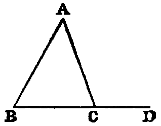

# Proposition 17: Two Angles of Triangle Less Than Two Right Angles

## Theorem
* Any two angles (B, C) of a triangle (ABC) are together less than two right angles.

## Demonstration
* Produce BC to D; then the exterior angle ACD is greater than ABC [xvi.]:
* to each add the angle ACB, and we have the sum of the angles ACD, ACB greater than the sum of the angles ABC, ACB;
* but the sum of the angles ACD, ACB is two right angles [xiii.].
* Therefore the sum of the angles ABC, ACB is less than two right angles.

* In like manner we may show that the sum of the angles A, B, or of the angles A, C, is less than two right angles.

## Corollaries
1. Every triangle must have at least two acute angles.
2. If two angles of a triangle be unequal, the lesser must be acute.

## Exercise

Prove Prop. xvii. without producing a side.
