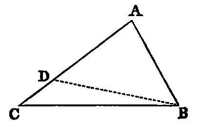
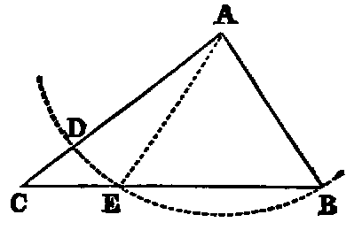

# Proposition 18: Angle Opposite Longer Side is Greater Than Angle Opposite Shorter One

## Theorem
* If in any triangle (ABC) one side (AC) be greater than another (AB), the angle opposite to the greater side is grater than the angle opposite to the less.

## Demonstration
* From AC cut off AD equal to AB [iii].
* Join BD (Post. i.).
* Now since AB is equal to AD, the triangle ABD is isosceles;
* therefore [v.] the angle ADB is equal to ABD;
* but the angle ADB is greater than the angle ACB [xvi.];
* therefore ABD is greater than ACB.
* Much more is the angle ABC greater than the angle ACB.

Or thus:
* From A as centre, with the lesser side AB as radius, describe the circle BED, cutting BC in E.
* Join AE.
* Now since AB is equal to AE, the angle AEB is equal to ABE;
* but AEB is greater than ACB (xvi.);
* therefore ABE is greater than ACB.

## Exercises

1. If in the second method the circle cut the line CB produced through B, prove the Proposition.
2. This Proposition may be proved by producing the less side.
3. If two of the opposite sides of a quadrilateral be respectively the greatest and least, the angles adjacent to the least are greater than their opposite angles.
4. In any triangle, the perpendicular from the vertex opposite the side which is not less than either of the remaining sides falls within the triangle.
