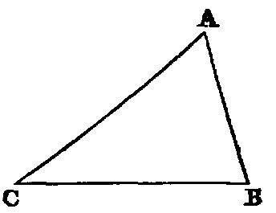

# Proposition 19: Side Opposite Larger Angle is Longer Than Side Opposite Smaller One

## Theorem
* If one angle (B) of a triangle (ABC) be greater than another angle (C), the side (AC) which it opposite to the greater angle is greater than the side (AB) which is opposite to the less.

## Demonstration
* If AC be not greater than AB, it must be either equal to it or less than it.
* Let us examine each case:
  1. If AC were equal to AB,
    * the triangle ACB would be isosceles,
    * and then the angle B would be equal to C [v.];
    * but it is not by hypothesis;
    * therefore AB is not equal to AC.
  2. If AC were less than AB,
    * the angle B would be less than the angle C [xviii.];
    * but it is not by hypothesis;
    * therefore AC is not less than AB;
    * and since AC is neither equal to AB nor less than it, it must be greater.

## Exercises

1. Prove this Proposition by a direct demonstration.
2. A line from the vertex of an isosceles triangle to any point in the base is less than either of the equal sides, but greater if the point be in the base produced.
3. Three equal lines could not be drawn from the same point to the same line.
4. The perpendicular is the least line which can be drawn from a given point to a given line; and of all others that may be drawn to it, that which is nearest to the perpendicular is less than any one more remote.
5. If in the fig., Prop. xvi., AB be the greatest side of the △ ABC, BF is the greatest side of the △ FBC, and the angle BFC is less than half the angle ABC.
6. If ABC be a △ having AB not greater than AC, a line AG, drawn from A to any point G in BC, is less than AC. For the angle ACB [xviii.] is not greater than ABC; but AGC [xvi.] is greater than ABC; therefore AGC is greater than ACG. Hence AC is greater than AG.
