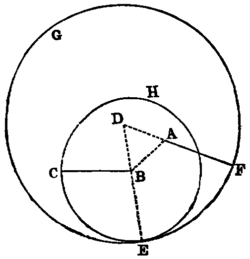

# Proposition 2: Extend Point to Right Line Equal to Another Right Line

## Problem
* From a given point (A) to draw a right line equal to a given finite right line (BC).

## Solution
* Join AB (Post. i.);
* on AB describe the equilateral triangle ABD [i.].
* With B as centre, and BC as radius, describe the circle ECH (Post iii.).
* Produce DB to meet the circle ECH in E (Post. ii.).
* With D as centre, and DE as radius, describe the circle EFG (Post. iii.).
* Produce DA to meet this circle in F. AF is equal to BC.

## Demonstration
* Because D is the centre of the circle EFG, DF is equal to DE (Def. xxxii.).
* And because DAB is an equilateral triangle, DA is equal to DB (Def. xxi.).
* Hence we have `DF = DE`, and `DA = DB`;
* and taking the latter from the former, the remainder AF is equal to the remainder BE (Axiom iii.).
* Again, because B is the centre of the circle ECH, BC is equal to BE;
* and we have proved that AF is equal to BE;
* and things which are equal to the same thing are equal to one another (Axiom i.).
* Hence AF is equal to BC.
* Therefore from the given point A the line AF has been drawn equal to BC.

It is usual with commentators on Euclid to say that he allows the use of the rule and compass. Were such the case this Proposition would have been unnecessary. The fact is, Euclid’s object was to teach Theoretical and not Practical Geometry, and the only things he postulates are the drawing of right lines and the describing of circles. If he allowed the mechanical use of the rule and compass he could give methods of solving many problems that go beyond the limits of the "geometry of the point, line, and circle." — See Notes D, F at the end of this work.

# Exercises

1. Solve the problem when the point A is in the line BC itself.
2. Inflect from a given point A to a given line BC a line equal to a given line. State the number of solutions.
