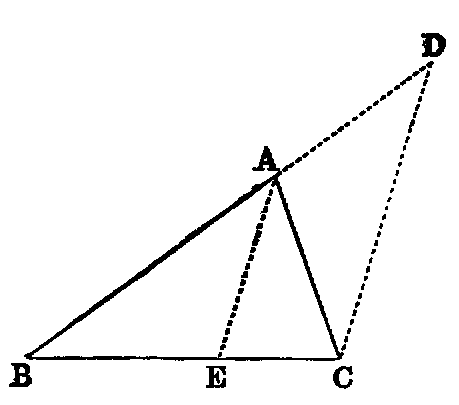

# Proposition 20: Sum of Two Sides of Triangle Greater Than the Third

## Theorem
* The sum of any two sides (BA, AC) of a triangle (ABC) is greater than the third.

## Demonstration
* Produce BA to D (Post. ii.), and make AD equal to AC [iii.].
* Join CD.
* Then because AD is equal to AC, the angle ACD is equal to ADC (v.);
* therefore the angle BCD is greater than the angle BDC;
* hence the side BD opposite to the greater angle is greater than BC opposite to the less [xix.].
* Again, since AC is equal to AD, adding BA to both, we have the sum of the sides BA, AC equal to BD.
* Therefore the sum of BA, AC is greater than BC.

Or thus:
* Bisect the angle BAC by AE [ix.]
* Then the angle BEA is greater than EAC;
* but EAC = EAB (const.);
* therefore the angle BEA is greater than EAB.
* Hence AB is greater than BE [xix.].
* In like manner AC is greater than EC.
* Therefore the sum of BA, AC is greater than BC.

## Definition
* A line drawn from any angle of a triangle to the middle point of the opposite side is called a **median** of the triangle.

## Exercises

1. In any triangle, the difference between any two sides is less than the third.
2. If any point within a triangle be joined to its angular points, the sum of the joining lines is greater than its semiperimeter.
3. If through the extremities of the base of a triangle, whose sides are unequal, lines be drawn to any point in the bisector of the vertical angle, their difference is less than the difference of the sides.
4. If the lines be drawn to any point in the bisector of the external vertical angle, their sum is greater than the sum of the sides.
5. Any side of any polygon is less than the sum of the remaining sides.
6. The perimeter of any triangle is greater than that of any inscribed triangle, and less than that of any circumscribed triangle.
7. The perimeter of any polygon is greater than that of any inscribed, and less than that of any circumscribed, polygon of the same number of sides.
8. The perimeter of a quadrilateral is greater than the sum of its diagonals.
9. The sum of the three medians of a triangle is less than its perimeter.
10. The sum of the diagonals of a quadrilateral is less than the sum of the lines which can be drawn to its angular points from any point except the intersection of the diagonals.

