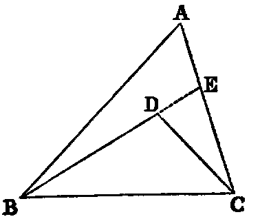
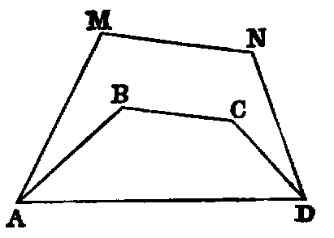

# Proposition 21: Any Point Within a Triangle Creates One With Shorter Sides And Larger Angle

## Theorem
* If two lines (BD, CD) be drawn to a point (D) within a triangle from the extremities of its base (BC), their sum is less than the sum of the remaining sides (BA, CA), but they contain a greater angle.

# Demonstration
1. Produce BD (Post. ii.) to meet AC in E.
  * Then, in the triangle BAE, the sum of the sides BA, AE is greater than the side BE [xx.]:
  * to each add EC, and we have the sum of BA, AC greater than the sum of BE, EC.
  * Again, the sum of the sides DE, EC of the triangle DEC is greater than DC:
  * to each add BD, and we get the sum of BE, EC greater than the sum of BD, DC;
  * but it has been proved that the sum of BA, AC is greater than the sum of BE, EC.
  * Therefore much more is the sum of BA, AC greater than the sum of BD, DC.

2. The external angle BDC of the triangle DEC is greater than the internal angle BEC [xvi.],
  * and the angle BEC, for a like reason, is greater than BAC.
  * Therefore much more is BDC greater than BAC.

Part 2 may be proved without producing either of the sides BD, DC. Thus:
* join AD and produce it to meet BC in F;
* then the angle BDF is greater than the angle BAF [xvi.], and FDC is greater than FAC.
* Therefore the whole angle BDC is greater than BAC.

## Exercises

1. The sum of the lines drawn from any point within a triangle to its angular points is less than the perimeter. (Compare Ex. 2, last Prop.)
2. If a convex polygonal line ABCD lie within a convex polygonal line AMND terminating in the same extremities, the length of the former is less than that of the latter.

