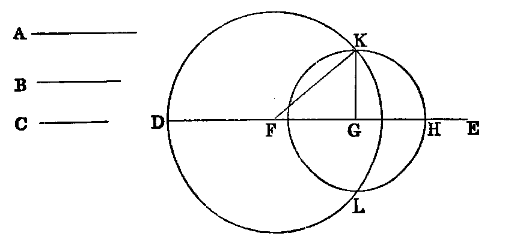

# Proposition 22: Construct Triangle From Three Given Lines

## Problem
* To construct a triangle whose three sides shall be respectively equal to three given lines (A, B, C), the sum of every two of which is greater than the third.

## Solution
* Take any right line DE, terminated at D, but unlimited towards E, and cut off [iii.] DF equal to A, FG equal to B, and GH equal to C.
* With F as centre, and FD as radius, describe the circle KDL (Post. iii.);
* and with G as centre, and GH as radius, describe the circle KHL, intersecting the former circle in K.
* Join KF, KG.
* KFG is the triangle required.

## Demonstration
* Since F is the centre of the circle KDL, FK is equal to FD;
* but FD is equal to A (const.);
* therefore (Axiom i.) FK is equal to A.
* In like manner GK is equal to C, and FG is equal to B (const.)
* Hence the three sides of the triangle KFG are respectively equal to the three lines A, B, C.

## Questions for Examination

1. What is the reason for stating in the enunciation that the sum of every two of the given lines must be greater than the third?
2. Prove that when that condition is fulfilled the two circles must intersect.
3. Under what conditions would the circles not intersect?
4. If the sum of two of the lines were equal to the third, would the circles meet? Prove that they would not intersect.
