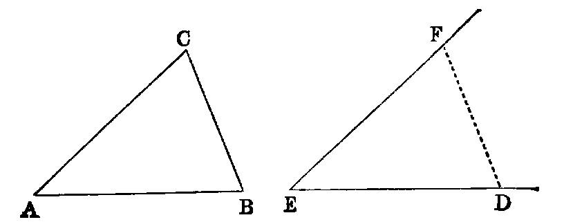

# Proposition 23: Transport Given Angle to Given Point and Line

## Problem
* At a given point (A) in a given right line (AB) to make an angle equal to a given rectilineal angle (DEF).

## Solution
* In the sides ED, EF of the given angle take any arbitrary points D and F.
* Join DF, and construct [xxii.] the triangle BAC, whose sides, taken in order, shall be equal to those of DEF — namely, AB equal to ED, AC equal to EF, and CB equal to FD;
* then the angle BAC will [viii.] be equal to DEF.
* Hence it is the required angle.

## Exercises

1. Construct a triangle, being given two sides and the angle between them.
2. Construct a triangle, being given two angles and the side between them.
3. Construct a triangle, being given two sides and the angle opposite to one of them.
4. Construct a triangle, being given the base, one of the angles at the base, and the sum or difference of the sides.
5. Given two points, one of which is in a given line, it is required to find another point in the given line, such that the sum or difference of its distances from the former points may be given. Show that two such points may be found in each case.
