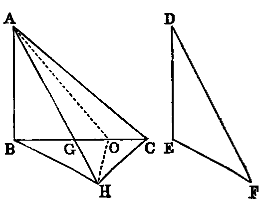

# Proposition 24:

## Theorem
* If two triangles (ABC, DEF) have two sides (AB, AC) of one respectively equal to two sides (DE, DF) of the other, but the contained angle (BAC) of one greater than the contained angle (EDF) of the other, the base of that which has the greater angle is greater than the base of the other.

## Demonstration
* Of the two sides AB, AC, let AB be the one which is not the greater, and with it make the angle BAG equal to EDF [xxiii.].
* Then because AB is not greater than AC, AG is less than AC [xix., Exer. 6].
* Produce AG to H, and make AH equal to DF or AC [iii.].
* Join BH, CH.
* In the triangles BAH, EDF, we have AB equal to DE (hyp.), AH equal to DF (const.), and the angle BAH equal to the angle EDF (const.);
* therefore the base [iv.] BH is equal to EF.
* Again, because AH is equal to AC (const.), the triangle ACH is isosceles;
* therefore the angle ACH is equal to AHC [v.];
* but ACH is greater than BCH;
* therefore AHC is greater than BCH:
* much more is the angle BHC greater than BCH, and the greater angle is subtended by the greater side [xix.].
* Therefore BC is greater than BH;
* but BH has been proved to be equal to EF;
* therefore BC is greater than EF.

The concluding part of this Proposition may be proved without joining CH, thus:—
* BG + GH > BH [xx.],
* AG + GC > AC [xx.];
* therefore	BC + AH > BH + AC;
* but AH = AC (const.);
* therefore BC is > BH.

Or thus:
* Bisect the angle CAH by AO.
* Join OH.
* Now in the △s CAO, HAO we have the sides CA, AO in one equal to the sides AH, AO in the other, and the contained angles equal;
* therefore the base OC is equal to the base OH [iv.]:
* to each add BO, and we have BC equal to the sum of BO, OH;
* but the sum of BO, OH is greater than BH [xx.].
* Therefore BC is greater than BH, that is, greater than EF.

## Exercises

1. Prove this Proposition by making the angle ABH to the left of AB.
2. Prove that the angle BCA is greater than EFD.
