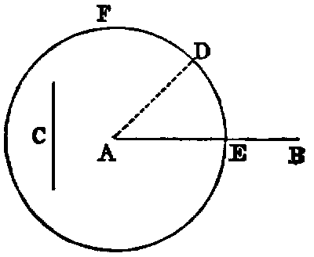

# Proposition 3: Cut a Longer Line to Make Equal to a Shorter One

Problem: From the greater (AB) of two given right lines to cut off a part equal to (C) the less.

Solution: From A, one of the extremities of AB, draw the right line AD equal to C [ii.]; and with A as centre, and AD as radius, describe the circle EDF (Post. iii.) cutting AB in E. AE shall be equal to C.

Demonstraion: Because A is the centre of the circle EDF, AE is equal to AD (Def. xxxii.), and C is equal to AD (const.); and things which are equal to the same are equal to one another (Axiom i.); therefore AE is equal to C. Wherefore from AB, the greater of the two given lines, a part, AE, has been out off equal to C, the less.

Questions for Examination.

1. What previous problem is employed in the solution of this?

2. What postulate?

3. What axiom in the demonstration?

4. Show how to produce the less of two given lines until the whole produced line becomes equal to the greater.