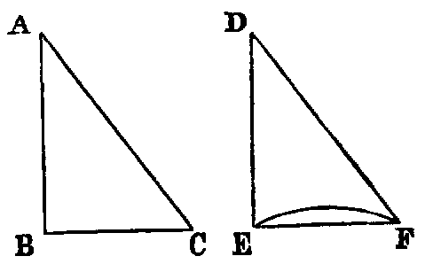

# Proposition 4: Two Triangles are Equal If Two Sides And Angle Between Are Equal

## Theorem
* If two triangles (BAC, EDF) have
  * two sides (BA, AC) of one equal respectively to two sides (ED, DF) of the other,
  * and have also the angles (A, D) included by those sides equal,
* the triangles shall be equal in every respect — that is,
  * their bases or third sides (BC, EF) shall be equal,
  * and the angles (B, C) at the base of one shall be respectively equal to the angles (E, F) at the base of the other;
  * namely, those shall be equal to which the equal sides are opposite.

## Demonstration
* Let us conceive the triangle BAC to be applied to EDF,
  * so that the point A shall coincide with D,
  * and the line AB with DE,
  * and that the point C shall be on the same side of DE as F;
* then because AB is equal to DE, the point B shall coincide with E.
* Again, because the angle BAC is equal to the angle EDF, the line AC shall coincide with DF;
* and since AC is equal to DF (hyp.), the point C shall coincide with F;
* and we have proved that the point B coincides with E.
* Hence two points of the line BC coincide with two points of the line EF;
* and since two right lines cannot enclose a space, BC must coincide with EF.
* Hence the triangles agree in every respect;
  * therefore BC is equal to EF,
  * the angle B is equal to the angle E,
  * the angle C to the angle F,
  * and the triangle BAC to the triangle EDF.

## Questions for Examination

1. How many parts in the hypothesis of this Proposition? Ans. Three. Name them.
2. How many in the conclusion? Name them.
3. What technical term is applied to figures which agree in everything but position? Ans. They are said to be congruent.
4. What is meant by superposition?
5. What axiom is made use of in superposition?
6. How many parts in a triangle? Ans. Six; namely, three sides and three angles.
7. When it is required to prove that two triangles are congruent, how many parts of one must be given equal to corresponding parts of the other? Ans. In general, any three except the three angles. This will be established in Props. viii. and xxvi., taken along with iv.
8. What property of two lines having two common points is quoted in this Proposition? They must coincide.

## Exercises

1. The line that bisects the vertical angle of an isosceles triangle bisects the base perpendicularly.
2. If two adjacent sides of a quadrilateral be equal, and the diagonal bisects the angle between them, their other sides are equal.
3. If two lines be at right angles, and if each bisect the other, then any point in either is equally distant from the extremities of the other.
4. If equilateral triangles be described on the sides of any triangle, the distances between the vertices of the original triangle and the opposite vertices of the equilateral triangles are equal. (This Proposition should be proved after the student has read Prop. xxxii.)
