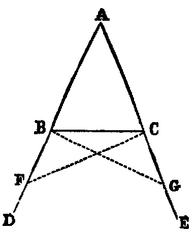
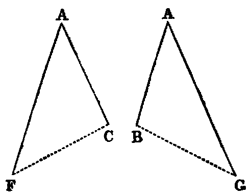
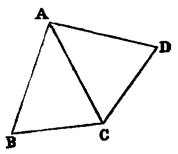

# Proposition 5. Base Interior and Exterior Angles of Isosceles Triangle are Equal

## Theorem
* The angles (ABC, ACB) at the base (BC) of an isosceles triangle are equal to one another,
* and if the equal sides (AB, AC) be produced, the external angles (DEC, ECB) below the base shall be equal.

## Demonstration
* In BD take any point F, and from AE, the greater, cut off AG equal to AF [iii].
* Join BG, CF (Post. i.).
* Because AF is equal to AG (const.), and AC is equal to AB (hyp.),
  * the two triangles FAC, GAB have the sides FA, AC in one respectively equal to the sides GA, AB in the other;
  * and the included angle A is common to both triangles.
* Hence [iv.] the base FC is equal to GB,
  * the angle AFC is equal to AGB,
  * and the angle ACF is equal to the angle ABG.

* Again, because AF is equal to AG (const.), and AB to AC (hyp.), the remainder, BF, is equal to CG (Axiom iii);
* and we have proved that FC is equal to GB, and the angle BFC equal to the angle CGB.
* Hence the two triangles BFC, CGB have the two sides BF, FC in one equal to the two sides CG, GB in the other;
* and the angle BFC contained by the two sides of one equal to the angle CGB contained by the two sides of the other.
* Therefore [iv.] these triangles have the angle FBC equal to the angle GCB, and these are the angles below the base.
* Also the angle FCB equal to GBC; but the whole angle FCA has been proved equal to the whole angle GBA.
* Hence the remaining angle ACB is equal to the remaining angle ABC, and these are the angles at the base.

## Observation
* The great difficulty which beginners find in this Proposition is due to the fact that the two triangles ACF, ABG overlap each other.
* The teacher should make these triangles separate, as in the annexed diagram, and point out the corresponding parts thus:
  * AF = AG,
  * AC = AB;
  * angle FAC	= angle GAB.
  * Hence [iv.], angle ACF = angle ABG.
  * and	angle AFC	= angle AGB.

The student should also be shown how to apply one of the triangles to the other, so as to bring them into coincidence. Similar Illustrations may be given of the triangles BFC, CGB.

* The following is a very easy proof of this Proposition.
  * Conceive the △ ACB to be turned, without alteration, round the line AC, until it falls on the other side.
  * Let ACD be its new position; then the angle ADC of the displaced triangle is evidently equal to the angle ABC, with which it originally coincided.
  * Again, the two △s BAC, CAD have the sides BA, AC of one respectively equal to the sides AC, AD of the other, and the included angles equal;
  * therefore [iv.] the angle ACB opposite to the side AB is equal to the angle ADC opposite to the side AC;
  * but the angle ADC is equal to ABC;
  * therefore ACB is equal to ABC.

## Corollary
* Every equilateral triangle is equiangular.

## Definition
* A line in any figure, such as AC in the preceding diagram, which is such that, by folding the plane of the figure round it, one part of the diagram will coincide with the other, is called an **axis of symmetry** of the figure.

## Exercises

1. Prove that the angles at the base are equal without producing the sides. Also by producing the sides through the vertex.
2. Prove that the line joining the point A to the intersection of the lines CF and BG is an axis of symmetry of the figure.
3. If two isosceles triangles be on the same base, and be either at the same or at opposite sides of it, the line joining their vertices is an axis of symmetry of the figure formed by them.
4. Show how to prove this Proposition by assuming as an axiom that every angle has a bisector.
5. Each diagonal of a lozenge is an axis of symmetry of the lozenge.
6. If three points be taken on the sides of an equilateral triangle, namely, one on each side, at equal distances from the angles, the lines joining them form a new equilateral triangle.
