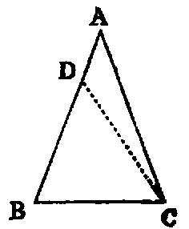

# Proposition 6: Two Angles of a Triangle Being Equal Means Their Opposite Sides are Equal

Theorem

If two angles (B, C) of a triangle be equal, the sides (AC, AB) opposite to them are also equal.

Demonstration: If AB, AC are not equal, one must be greater than the other. Suppose AB is the greater, and that the part BD is equal to AC. Join CD (Post. i.). Then the two triangles DBC, ACB have BD equal to AC, and BC common to both. Therefore the two sides DB, BC in one are equal to the two sides AC, CB in the other; and the angle DBC in one is equal to the angle ACB in the other (hyp). Therefore [iv.] the triangle DBC is equal to the triangle ACB—the less to the greater, which is absurd; hence AC, AB are not unequal, that is, they are equal.

Questions for Examination.

1. What is the hypothesis in this Proposition?

2. What Proposition is this the converse of?

3. What is the obverse of this Proposition?

4. What is the obverse of Prop. v.?

5. What is meant by an indirect proof?

6. How does Euclid generally prove converse Propositions?

7. What false assumption is made in the demonstration?

8. What does this assumption lead to?
