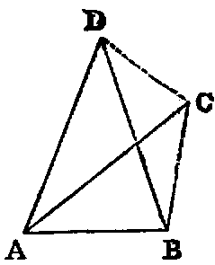
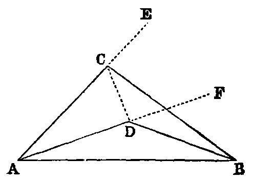

# Proposition 7: Conterminous Sides of Two Triangles Sharing the Same Base

## Theorem
* If two triangles (ACB, ADB) on the same base (AB) and on the same side of it have one pair of conterminous sides (AC, AD) equal to one another, the other pair of conterminous sides (BC, BD) must be unequal.

## Demonstration
1. Let the vertex of each triangle be without the other.
  * Join CD.
  * Then because AD is equal to AC (hyp.), the triangle ACD is isosceles;
  * therefore [v.] the angle ACD is equal to the angle ADC;
  * but ADC is greater than BDC (Axiom ix.);
  * therefore ACD is greater than BDC: much, more is BCD greater than BDC.
  * Now if the side BD were equal to BC, the angle BCD would be equal to BDC [v.];
  * but it has been proved to be greater. Hence BD is not equal to BC.

2. Let the vertex of one triangle ADB fall within the other triangle ACB.
  * Produce the sides AC, AD to E and F.
  * Then because AC is equal to AD (hyp.), the triangle ACD is isosceles, and [v.] the external angles ECD, FDC at the other side of the base CD are equal;
  * but ECD is greater than BCD (Axiom ix.).
  * Therefore FDC is greater than BCD: much more is BDC greater than BCD;
  * but if BC were equal to BD, the angle BDC would be equal to BCD [v.];
  * therefore BC cannot be equal to BD.

3. If the vertex D of the second triangle fall on the line BC, it is evident that BC and BD are unequal.

## Questions for Examination

1. What use is made of Prop. vii.? Ans. As a lemma to Prop. viii.
2. In the demonstration of Prop. vii. the contrapositive of Prop. v. occurs; show where.
3. Show that two circles can intersect each other only in one point on the same side of the line joining their centres, and hence that two circles cannot have more than two points of intersection.
