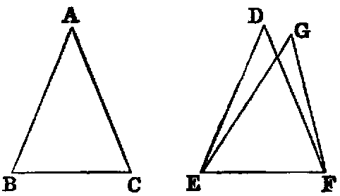
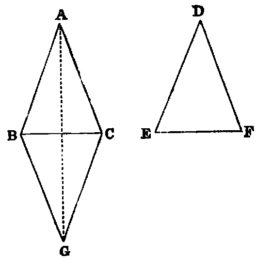

# Proposition 8: Triangles with Three Equal Sides are Equal and have Equal Angles

## Theorem
* If two triangles (ABC, DEF) have:
  * two sides (AB, AC) of one respectively equal to two sides (DE, DF) of the other,
  * and have also the base (BC) of one equal to the base (EF) of the other;
* then the two triangles shall be equal,
* and the angles of one shall be respectively equal to the angles of the other,
* namely, those shall be equal to which the equal sides are opposite.

## Demonstration
* Let the triangle ABC be applied to DEF, so that the point B will coincide with E, and the line BC with the line EF;
* then because BC is equal to EF, the point C shall coincide with F.
* Then if the vertex A fall on the same side of EF as the vertex D, the point A must coincide with D;
* for if not, let it take a different position G; then we have EG equal to BA, and BA is equal to ED (hyp.).
* Hence (Axiom i.) EG is equal to ED: in like manner, FG is equal to FD, and this is impossible [vii.].
* Hence the point A must coincide with D, and the triangle ABC agrees in every respect with the triangle DEF;
* and therefore the three angles of one are respectively equal to the three angles of the other—namely, A to D, B to E, and C to F, and the two triangles are equal.

* This Proposition is the converse of iv., and is the second case of the congruence of triangles in the Elements.

## Philo’s Proof
  * Let the equal bases be applied as in the foregoing proof, but let the vertices be on the opposite sides;
  * then let BGC be the position which EDF takes.
  * Join AG.
  * Then because BG = BA, the angle BAG = BGA.
  * In like manner the angle CAG = CGA.
  * Hence the whole angle BAC = BGC;
  * but BGC = EDF therefore BAC = EDF.

