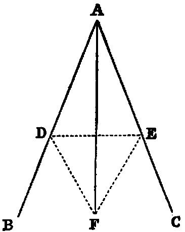

# Proposition 9: Bisect a Given Angle

## Problem
* To bisect a given rectilineal angle (BAC).

## Solution
* In AB take any point D, and cut off [iii.] AE equal to AD.
* Join DE (Post. i.), and upon it, on the side remote from A, describe the equilateral triangle DEF [i.]
* Join AF.
* AF bisects the given angle BAC.

## Demonstration
* The triangles DAF, EAF have the side AD equal to AE (const.) and AF common;
* therefore the two sides DA, AF are respectively equal to EA, AF,
* and the base DF is equal to the base EF, because they are the sides of an equilateral triangle (Def. xxi.).
* Therefore [viii.] the angle DAF is equal to the angle EAF;
* hence the angle BAC is bisected by the line AF.

## Corollary

* The line AF is an axis of symmetry of the figure.

## Questions for Examination

1. Why does Euclid describe the equilateral triangle on the side remote from A?
2. In what case would the construction fail, if the equilateral triangle were described on the other side of DE?

## Exercises

1. Prove this Proposition without using Prop. viii.
2. Prove that AF is perpendicular to DE.
3. Prove that any point in AF is equally distant from the points D and E.
4. Prove that any point in AF is equally distant from the lines AB, AC.
