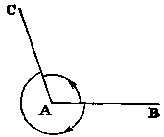
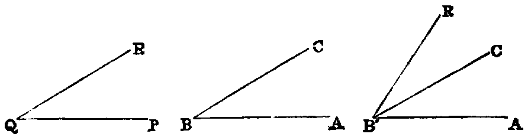
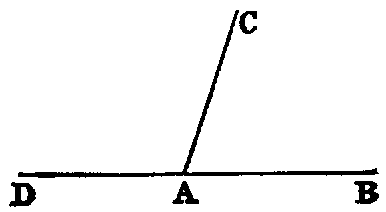
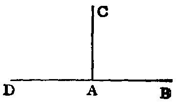
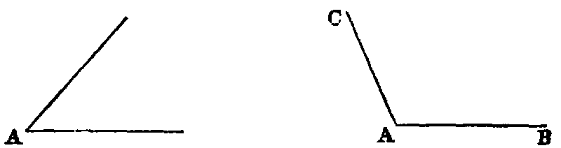
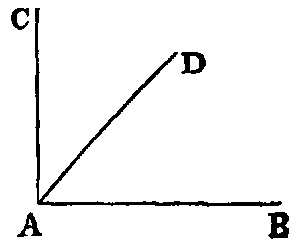

# The Angle

The inclination of two right lines extending out from one point in different directions is called a rectilineal angle.

.10. The two lines are called the legs, and the point the vertex of the angle.

A light line drawn from the vertex and turning about it in the plane of the angle, from the position of coincidence with one leg to that of coincidence with the other, is said to turn through the angle, and the angle is the greater as the quantity of turning is the greater. Again, since the line may turn from one position to the other in either of two ways, two angles are formed by two lines drawn from a point.

Thus if AB, AC be the legs, a line may turn from the position AB to the position AC in the two ways indicated by the arrows. The smaller of the angles thus formed is to be understood as the angle contained by the lines. The larger, called a re-entrant angle, seldom occurs in the “Elements.”

.11. Designation of Angles.—A particular angle in a figure is denoted by three letters, as BAC, of which the middle one, A, is at the vertex, and the other two along the legs. The angle is then read BAC.

.12. The angle formed by joining two or more angles together is called their sum. Thus the sum of the two angles ABC, PQR is the angle AB′R, formed by applying the side QP to the side BC, so that the vertex Q shall fall on the vertex B, and the side QR on the opposite side of BC from BA.

.13. When the sum of two angles BAC, CAD is such that the legs BA, AD form one right line, they are called supplements of each other.

Hence, when one line stands on another, the two angles which it makes on the same side of that on which it stands are supplements of each other.

.14. When one line stands on another, and makes the adjacent angles at both sides of itself equal, each of the angles is called a right angle, and the line which stands on the other is called a perpendicular to it.

Hence a right angle is equal to its supplement.

.15. An acute angle is one which is less than a right angle, as A.

.16. An obtuse angle is one which is greater than a right angle, as BAC.

The supplement of an acute angle is obtuse, and conversely, the supplement of an obtuse angle is acute.

.17. When the sum of two angles is a right angle, each is called the complement of the other. Thus, if the angle BAC be right, the angles BAD, DAC are complements of each other.

