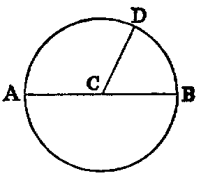

# The Circle

.32. A circle is a plane figure formed by a curved line called the circumference, and is such that all right lines drawn from a certain point within the figure to the circumference are equal to one another. This point is called the centre.

.33. A radius of a circle is any right line drawn from the centre to the circumference, such as CD.

.34. A diameter of a circle is a right line drawn through the centre and terminated both ways by the circumference, such as AB.

From the definition of a circle it follows at once that the path of a movable point in a plane which remains at a constant distance from a fixed point is a circle; also that any point P in the plane is inside, outside, or on the circumference of a circle according as its distance from the centre is less than, greater than, or equal to, the radius.