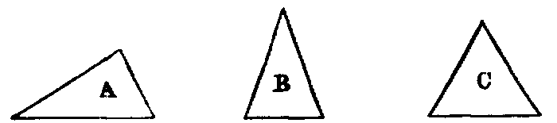
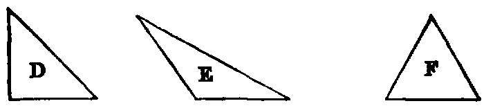

# The Triangle

.20. A triangle is a figure formed by three right lines joined end to end. The three lines are called its sides.

.21. A triangle whose three sides are unequal is said to be scalene, as A; a triangle having two sides equal, to be isosceles, as B; and and having all its sides equal, to be equilateral, as C.

.22. A right-angled triangle is one that has one of its angles a right angle, as D. The side which subtends the right angle is called the hypotenuse.

.23. An obtuse-angled triangle is one that has one of its angles obtuse, as E.

.24. An acute-angled triangle is one that has its three angles acute, as F.

.25. An exterior angle of a triangle is one that is formed by any side and the continuation of another side.

Hence a triangle has six exterior angles; and also each exterior angle is the supplement of the adjacent interior angle.
